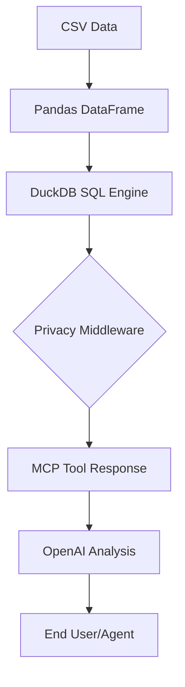

# 📊 Data Analyst MCP Server

[](https://www.python.org/downloads/)
[](https://opensource.org/licenses/MIT)
[](https://modelcontextprotocol.io/)

A powerful Model Context Protocol (MCP) server that provides comprehensive data analysis capabilities for CSV files. This server acts as an intelligent data analyst agent, enabling SQL queries, AI-powered insights, and privacy-protected data handling.

---

## 📑 Table of Contents
- [🌟 Features](#-features)
- [🛡️ Privacy by Design](#️-privacy-by-design)
- [🚀 Quick Start](#-quick-start)
- [📋 Configuration](#-configuration)
- [🤖 Dify Agent Integration](#-dify-agent-integration)
- [🔧 Available Tools](#-available-tools)
- [💡 Usage Examples](#-usage-examples)
- [🛠️ Technical Architecture](#️-technical-architecture)
- [🔒 Safety & Limits](#-safety--limits)
- [🐛 Troubleshooting](#-troubleshooting)
- [🤝 Contributing](#-contributing)
- [📄 License](#-license)

---

## 🌟 Features

### Core Capabilities
- **Data Schema Inspection**: Automatically analyze CSV structure, data types, and statistics.
- **SQL Query Engine**: Full DuckDB integration for complex data analysis.
- **AI-Powered Analysis**: OpenAI integration for intelligent data insights and recommendations.
- **Privacy Protection**: Built-in PII (Personally Identifiable Information) masking middleware.

### Available Tools
1. **`get_data_schema`** - Comprehensive data structure analysis.
2. **`run_sql_query`** - Execute SQL queries on your data.
3. **`analyze_with_ai`** - AI-powered data analysis with structured output.

---

## 🛡️ Security & Privacy Architecture

Security is a foundational pillar of this MCP server. We implement a **3-Layer Defense Model** to ensure that sensitive data never leaks to AI models or unauthorized endpoints.

### 1. The 3-Layer Defense Model

| Layer | Component | Protection Mechanism |
| :--- | :--- | :--- |
| **Layer 1: Schema** | `get_data_schema` | Sensitive columns are marked as `PROTECTED`. Sample values and statistics are automatically withheld for these columns. |
| **Layer 2: SQL** | `run_sql_query` | Every query result passes through a **PII Masking Middleware** before being returned. This catches both direct column matches and pattern-based hits. |
| **Layer 3: AI** | `analyze_with_ai` | Data is redacted *before* being sent to OpenAI. Even if a user asks a question about sensitive data, the AI only sees `[REDACTED]` tokens. |

### 2. PII Masking & Redaction Logic

The server utilizes a sophisticated masking engine in `my_server.py` that identifies sensitive data through two primary methods:

- **Column-Name matching**: Any column containing keywords like `email`, `phone`, `credit_card`, `ssn`, `address`, `name`, or `zip` is immediately flagged for redaction.
- **Regex-Based Detection**: A deep-content scan is performed on string-based data to identify patterns like email addresses (e.g., `user@example.com` becomes `[EMAIL_REDACTED]`) even in non-flagged columns.

### 3. Local-First Processing (The "Privacy Advantage")

Unlike traditional data platforms that upload your data to a cloud for processing:
- **In-Memory Execution**: This server uses **DuckDB**, an in-memory SQL engine. Your raw data never leaves your local machine.
- **Edge Intelligence**: All complex joining, filtering, and masking happens locally. Only anonymized, redacted summaries are ever transmitted to the AI layer.

> [!CAUTION]
> **Data Residency**: Because processing is local, your raw sensitive data remains within your security perimeter. This makes the server compliant with many internal "No Cloud Data" policies.

---

## 🔒 Security Best Practices

To maintain the highest level of security, we recommend:

1. **Environment Isolation**: Always use a `.env` file and never hardcode your `OPENAI_API_KEY`.
2. **Minimal Scoping**: Only provide the server access to the specific CSV files required for the task.
3. **Audit SENSITIVE_PATTERNS**: Customize the `SENSITIVE_PATTERNS` list in `my_server.py` to include any industry-specific identifiers you work with (e.g., `account_id`, `patient_num`).
4. **Rate Limit Awareness**: Be aware that large data volumes are truncated to 4000 characters. This acts as an accidental but useful "sanity check" against sending too much context to external APIs.

---

## 🚀 Quick Start

### 1. Prerequisites
- Python 3.8+
- OpenAI API key (required for AI analysis)
- `sensitive_sales_data_v2.csv` (provided in the repository)

### 2. Installation

We recommend using a virtual environment:

```bash
# Create and activate virtual environment
python -m venv venv
source venv/bin/activate  # Linux/macOS
.\venv\Scripts\activate   # Windows

# Install core dependencies
pip install fastmcp pandas numpy duckdb openai python-dotenv matplotlib seaborn
```

### 3. Setup Environment Variables

Create a `.env` file in the project root:

```bash
OPENAI_API_KEY="your_openai_api_key_here"
CSV_FILE_PATH="sensitive_sales_data_v2.csv"
```

### 4. Running the Server

```bash
python my_server.py
```

---

## 📋 Configuration

| Environment Variable | Description | Default |
| :--- | :--- | :--- |
| `OPENAI_API_KEY` | **Required** for AI analysis features | - |
| `CSV_FILE_PATH` | Path to your CSV file | `sensitive_sales_data_v2.csv` |
| `TABLE_NAME` | Name used for SQL table operations | `data` |

### AI Settings (GPT-4o-mini)
- **Temperature**: 0.3 (Balanced focus/creativity)
- **Max Tokens**: 1000
- **Data Limit**: 4000 characters (Automatic truncation)

---

## 🤖 Dify Agent Integration

Configure a Dify Agent to work seamlessly with your MCP server.

### System Instructions
Use the provided role definition in Dify:
> **Role:** Senior Data Analyst Agent
> **Goal:** Derive actionable insights, visualize trends, and provide strategic recommendations.

Recommended opening message:
> "Hello! 👋 I am your Senior Data Analyst. I have access to your sales database and can help with SQL queries, trend analysis, and business recommendations."

---

## 🔧 Available Tools

### 1. `get_data_schema()`
Returns JSON with table name, columns, row count, and column details. Always run this first.

### 2. `run_sql_query(query: str)`
Executes SQL queries using DuckDB.
```sql
SELECT Region, SUM(Total_Revenue) FROM data GROUP BY Region
```

### 3. `analyze_with_ai(data_context: str, user_question: str)`
AI-generated analysis with sections: **summary**, **insights**, and **recommendations**.

---

## 💡 Usage Examples

### SQL Analysis Example
**Query:** `SELECT Date, Units_Sold FROM data WHERE Product_Category = 'Electronics' LIMIT 5`
**Result:** Returns a table of recent electronics sales.

### AI Insight Example
**Action:** Pass query results to `analyze_with_ai`.
**Result:**
- **Summary:** Quick overview of electronics sales growth.
- **Insights:** Identification of peak sales hours or seasonal trends.
- **Recommendations:** Suggestions for inventory management based on sales velocity.

---

## �️ Technical Architecture



---

## 🔒 Safety & Limits

- **Data Truncation**: Inputs over 4000 characters are safely truncated to stay within AI context limits.
- **Rate Limiting**: Handles OpenAI rate limits gracefully with informative error messages.
- **SQL Security**: Read-only operations on in-memory data.

---

## 🐛 Troubleshooting

- **CSV Not Found**: Ensure the file path in `.env` matches your file location.
- **API Key Missing**: Verify `OPENAI_API_KEY` is correctly set in your environment or `.env` file.
- **Rate Limits**: If you hit OpenAI limits, wait a few seconds or reduce the data scope in your SQL queries.

---

## 🤝 Contributing
Contributions are welcome! Please fork the repo and submit a pull request for any improvements.

## 📄 License
This project is licensed under the MIT License.

---
**Built with ❤️ for data analysts and developers**
